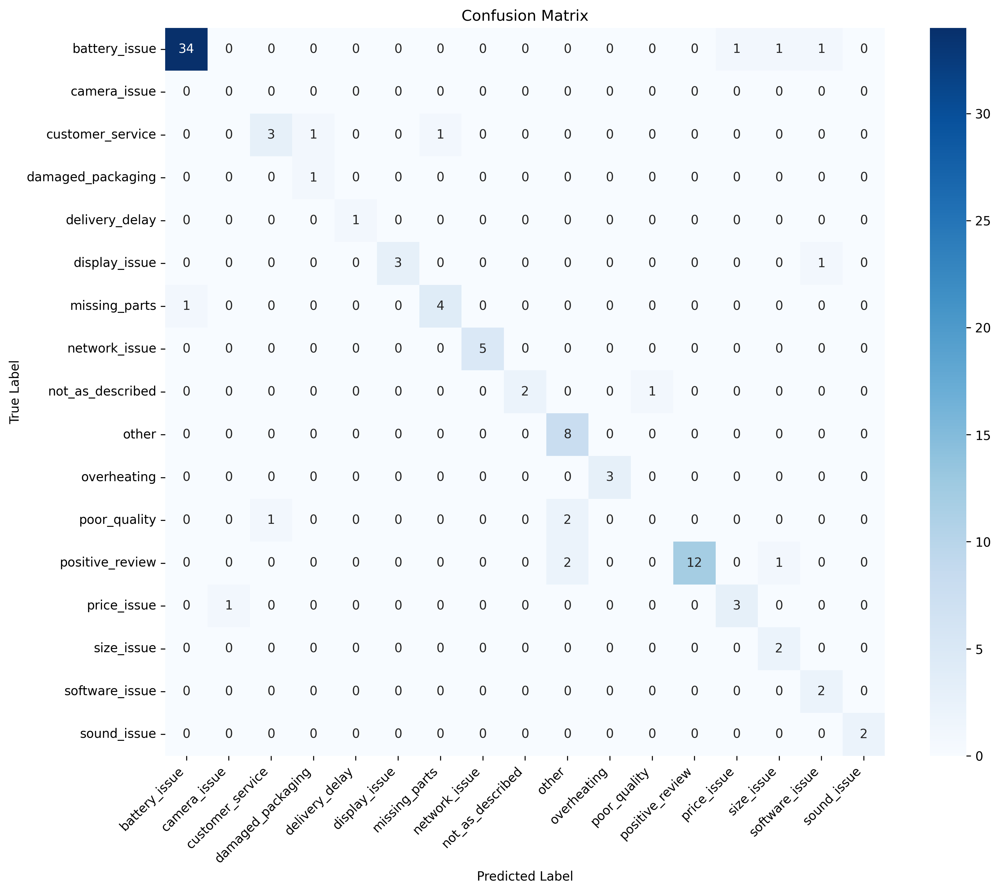
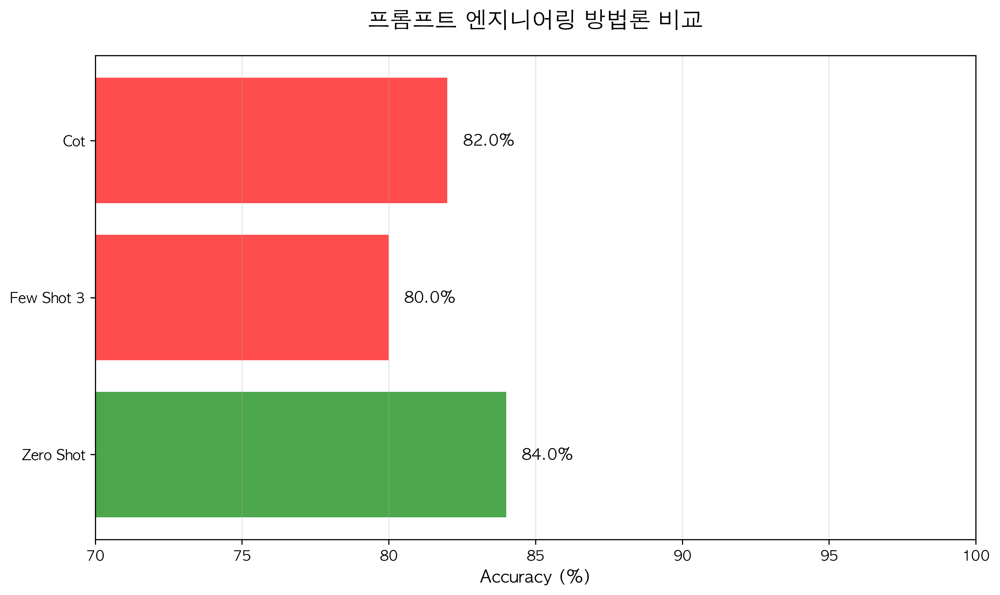

# AI-Powered E-commerce Review Analysis

> LLM과 고급 AI 기법을 활용한 이커머스 리뷰 자동 분석 시스템

## 🎯 프로젝트 개요

고객 리뷰를 AI로 분석하여 **핵심 문제점 자동 도출**, **급증 이슈 탐지**, **개선 액션 제안**을 자동화하는 시스템입니다.

### 해결하는 문제

| Before | After |
|--------|-------|
| 수천 개 리뷰를 사람이 직접 읽어야 함 | AI가 자동 분류 및 패턴 분석 |
| 어떤 문제가 급증하는지 파악 불가 | 시계열 비교로 급증 이슈 자동 탐지 |
| 개선 우선순위 판단에 시간 소요 | 즉시 실행 가능한 액션 자동 제안 |

---

## 📊 성과 지표

| Metric | Value | Note |
|--------|-------|------|
| **Accuracy** | **85%** | 100개 Ground Truth 기준 |
| **Precision** | 87.53% | Weighted Average |
| **F1 Score** | 85.17% | Weighted Average |
| **Processing Speed** | 100 reviews/min | GPT-4o-mini 기준 |

### 카테고리별 성능 (Top 5)

| Category | F1 Score | Support |
|----------|----------|---------|
| network_issue | 100% | 5 |
| overheating | 100% | 3 |
| sound_issue | 100% | 2 |
| battery_issue | 94.4% | 37 |
| positive_review | 88.9% | 15 |

---

## 🔬 기술적 접근

### Level 1: 정량적 평가 시스템
- Ground Truth 100개 구축 (자동 라벨링 + 검수)
- Accuracy, Precision, Recall, F1 Score 자동 측정
- Confusion Matrix 시각화

### Level 2: 프롬프트 엔지니어링
4가지 전략 비교 실험:

| Strategy | Accuracy | vs Baseline |
|----------|----------|-------------|
| Zero-shot | **84%** | Best |
| Few-shot (3-shot) | 80% | -4% |
| Chain-of-Thought | 82% | -2% |
| Temperature 0.7 | 83% | -1% |

### Level 3: 에러 분석 & 개선
- 주요 혼동 패턴: `positive_review` ↔ `other`, `poor_quality` ↔ `customer_service`
- 리뷰 길이별, 평점별 에러 분포 분석
- 자동 개선안 제시 시스템

### Level 4-1: 멀티 에이전트 시스템
Self-Consistency 기반 다중 관점 분석:

```
┌─────────────────────────────────────┐
│         Coordinator Agent           │
│      (최종 결정 및 합의 도출)          │
└──────────┬──────────────────────────┘
           │
    ┌──────┴──────┐
    ▼             ▼
┌─────────┐   ┌─────────┐   ┌─────────┐
│Agent 1  │   │Agent 2  │   │Agent 3  │
│ General │   │Operational│  │ Product │
└─────────┘   └─────────┘   └─────────┘
```

- 3가지 합의 방법: 다수결 투표, 가중치 합의, LLM 중재

### Level 4-2: RAG + Vector DB
- ChromaDB + Sentence Transformers
- 유사 리뷰 검색 기반 동적 Few-shot Learning

### Level 4-3: Fine-tuning 준비
- OpenAI Fine-tuning 형식 학습 데이터 생성
- JSONL 형식 자동 변환

---

## 🛠️ 기술 스택

| Category | Technology |
|----------|------------|
| **Language** | Python 3.11+ |
| **LLM** | OpenAI GPT-4o-mini |
| **Vector DB** | ChromaDB |
| **Embedding** | Sentence Transformers |
| **Evaluation** | scikit-learn |
| **Visualization** | matplotlib, seaborn |

---

## 📁 프로젝트 구조

```
analyze-review/
├── main.py                      # Kaggle 데이터셋 분석
├── analyze_csv.py               # 커스텀 CSV 분석
├── analyzer.py                  # 핵심 분석 로직
├── data_loader.py               # 데이터 처리
├── config.py                    # 설정
│
├── evaluation/                  # Level 1: 평가 시스템
│   ├── evaluate.py              # 정확도 측정
│   ├── auto_labeling.py         # 자동 라벨링
│   └── evaluation_dataset.csv   # Ground Truth
│
├── experiments/                 # Level 2-3: 실험
│   ├── prompt_engineering.py    # 프롬프트 실험
│   └── error_analysis.py        # 에러 분석
│
├── advanced/                    # Level 4: 고급 기법
│   ├── multi_agent_analyzer.py  # 멀티 에이전트
│   └── rag_system.py            # RAG 시스템
│
├── visualization/               # 시각화
│   └── create_charts.py
│
└── results/                     # 실험 결과
    ├── baseline_confusion_matrix.png
    ├── prompt_experiments_*.json
    ├── error_analysis_*.json
    └── figures/
        ├── accuracy_improvement.png
        ├── method_comparison.png
        └── per_class_performance.png
```

---

## 🚀 빠른 시작

### 1. 설치

```bash
git clone https://github.com/heeoneie/analyze-review.git
cd analyze-review

# uv 사용 (권장)
uv venv && source .venv/bin/activate
uv pip install -r requirements.txt

# 또는 pip 사용
python -m venv venv && source venv/bin/activate
pip install -r requirements.txt
```

### 2. 환경변수 설정

```bash
# .env 파일 생성
OPENAI_API_KEY=your_api_key_here
```

### 3. 실행

```bash
# 기본 분석
python main.py

# 커스텀 CSV 분석
python analyze_csv.py your_reviews.csv

# 평가 시스템
PYTHONPATH=. python evaluation/evaluate.py --mode baseline

# 프롬프트 실험
PYTHONPATH=. python experiments/prompt_engineering.py

# 멀티 에이전트
PYTHONPATH=. python advanced/multi_agent_analyzer.py
```

---

## 📈 실험 결과 시각화

### Confusion Matrix


### 방법론 비교


---

## 💡 주요 발견

1. **Zero-shot이 Few-shot보다 성능이 좋음**
   - iPhone 리뷰 특성에 맞춘 카테고리 정의가 이미 명확함
   - 추가 예시가 오히려 혼란 유발

2. **배터리 이슈가 전체의 37% 차지**
   - iPhone SE 리뷰 특성상 battery_issue가 dominant

3. **positive_review 카테고리 필요**
   - 낮은 평점에도 긍정적 내용의 리뷰 15% 존재

4. **멀티 에이전트로 애매한 케이스 해결**
   - 3개 관점에서 분류 후 합의

---

## 🎓 배운 점

- LLM 기반 분류에서 **프롬프트 설계**가 핵심
- **정량적 평가 없이는 개선 방향 판단 불가**
- **도메인 특화 카테고리**가 일반 카테고리보다 효과적
- Self-Consistency로 **신뢰도 향상** 가능

---

## 📝 향후 개선

- [ ] Fine-tuning으로 비용 절감 및 속도 향상
- [ ] 실시간 리뷰 모니터링 대시보드
- [ ] 다국어 지원 (한국어, 일본어)
- [ ] A/B 테스트 결과와 연계

---

## 📄 License

MIT License

---

## 🤝 Contact

질문이나 제안은 GitHub Issues로 등록해주세요.
