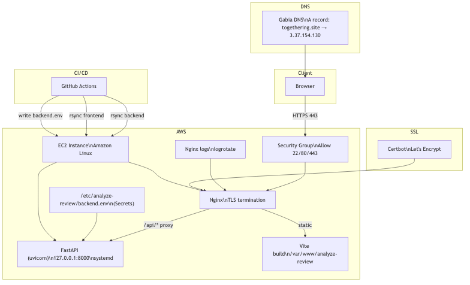
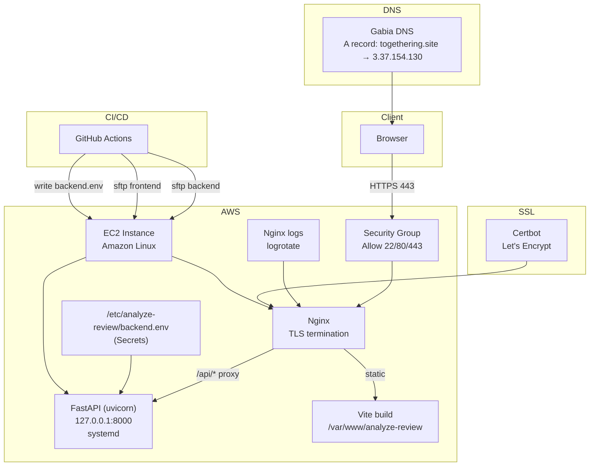

# EC2 배포 가이드 (Nginx + systemd + GitHub Actions)

이 폴더는 EC2에 백엔드(FastAPI)와 프론트엔드(Vite) 배포를 위한 기본 인프라 템플릿입니다.

## 0) 전제

- EC2: Amazon Linux 기준 (yum 사용)
- 보안 그룹: `22`, `80`, `443` 오픈
- 도메인: 가비아 DNS에서 A 레코드로 EC2 공인 IP 연결

## 1) EC2 1회 초기 설정

```bash
sudo yum update -y
sudo yum install -y nginx python3 python3-pip
sudo systemctl enable --now nginx
sudo yum install -y git

# 배포 디렉터리 생성
sudo mkdir -p /opt/analyze-review/current
sudo mkdir -p /var/www/analyze-review
sudo mkdir -p /var/www/letsencrypt
sudo mkdir -p /etc/analyze-review
sudo chown -R $USER:$USER /opt/analyze-review /var/www/analyze-review
```

### 1.1) GitHub Actions 배포용 SSH 키 등록 (EC2)

GitHub Actions가 EC2로 접속하려면 EC2에 공개키가 등록되어 있어야 합니다.

```bash
mkdir -p ~/.ssh
chmod 700 ~/.ssh

# 로컬에서 만든 공개키를 추가
cat <<'KEY' >> ~/.ssh/authorized_keys
ssh-rsa AAAAB3Nza...your-public-key... user@local
KEY

chmod 600 ~/.ssh/authorized_keys
```

### 백엔드 환경변수 파일 생성

GitHub Actions가 `BACKEND_ENV_FILE` 시크릿을 이용해 `/etc/analyze-review/backend.env`를 자동 생성합니다.

## 2) systemd 서비스 등록

```bash
sudo cp infra/systemd/analyze-review-backend.service /etc/systemd/system/
sudo systemctl daemon-reload
sudo systemctl enable analyze-review-backend
```

## 3) Nginx 설정 (HTTPS 포함)

```bash
sudo cp infra/nginx/analyze-review.conf /etc/nginx/conf.d/analyze-review.conf
sudo nginx -t
sudo systemctl reload nginx
```

### HTTPS (필수)

Certbot을 사용하세요:

```bash
sudo yum install -y certbot python3-certbot-nginx
sudo certbot --nginx -d togethering.site
```

인증서 발급 후 `analyze-review.conf`의 인증서 경로를 확인하세요.

## 3.1) 도메인 값 반영 체크

- `/etc/nginx/conf.d/analyze-review.conf`의 `server_name` (`togethering.site`)
- `/etc/analyze-review/backend.env`의 `ALLOWED_ORIGINS`
- GitHub Secrets의 `FRONTEND_ENV_FILE`

## 4) GitHub Secrets 설정

Repo -> Settings -> Secrets and variables -> Actions

- `EC2_HOST`: EC2 공인 IP 또는 도메인
- `EC2_USER`: SSH 사용자 (예: `ec2-user`)
- `EC2_SSH_KEY`: SSH private key
- `EC2_SSH_PORT`: SSH 포트 (기본 `22`면 생략 가능)
- `BACKEND_ENV_FILE`: 백엔드 `.env` 전체 내용
- `FRONTEND_ENV_FILE`: 프론트 `.env` 전체 내용 (예: `VITE_API_BASE_URL=https://togethering.site/api`)

## 5) 배포 동작

- `main` 브랜치에 push 시 GitHub Actions가 자동 배포


## 6) 인프라 구성 요약

1. GitHub Actions가 `main`에 push 시 배포를 트리거
2. 프론트엔드는 `frontend/dist`를 tar로 묶어 SFTP 전송 후 `/var/www/analyze-review`에 풀림
3. 백엔드는 소스 전체를 tar로 묶어 SFTP 전송 후 `/opt/analyze-review/current`에 풀림, systemd 서비스로 실행
4. Nginx가 정적 파일을 서빙하고 `/api/`는 FastAPI로 프록시
5. HTTPS는 Let's Encrypt + Certbot으로 종료
6. Nginx 로그는 별도 파일로 분리되고 logrotate로 관리

## 6.1) 인프라 흐름 (요청/배포/인증서/로그)

이미지 버전:





## 7) 문제 해결

- backend 로그:

```bash
sudo journalctl -u analyze-review-backend -f
```

- nginx 로그:

```bash
sudo tail -f /var/log/nginx/analyze-review.error.log
```

## 8) Nginx 로그 로테이션

```bash
sudo cp infra/nginx/analyze-review-logrotate /etc/logrotate.d/analyze-review
sudo logrotate -f /etc/logrotate.d/analyze-review
```
